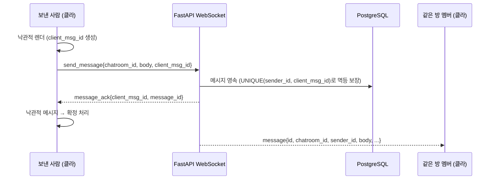
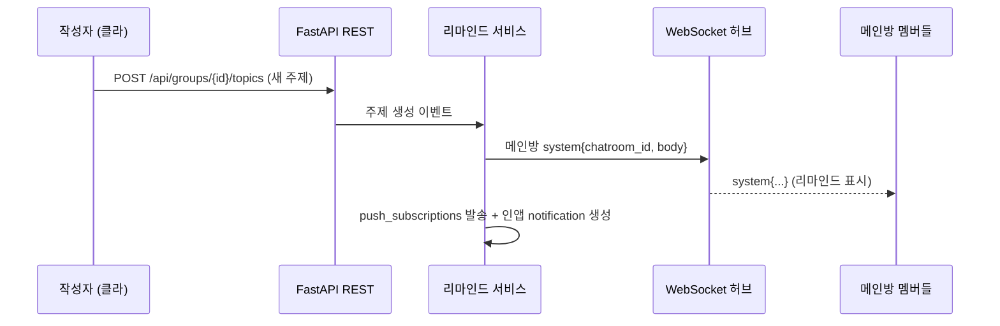

# API 계약 (REST + WebSocket)

백엔드 FastAPI가 노출하는 REST 엔드포인트 24개와 실시간 WebSocket 프로토콜, 인증 모델을 정리한 계약 문서다.

> 버전 v1 · 2026-06-16 · SSOT: plan.json

## 개요

- **REST**: 동기 자원 조작(인증·그룹·주제·미디어·알림)에 사용한다. JSON 요청/응답.
- **WebSocket**: 채팅 메시지 송수신과 리마인드 시스템 메시지처럼 실시간성이 필요한 흐름에 사용한다.
- **경로 prefix**: 백엔드로 가는 모든 경로는 `/api`로 시작한다 — REST는 `/api/...`, WebSocket은 `/api/ws`. 배포의 Caddy는 `/api/*`만 FastAPI로 프록시하고 나머지는 SvelteKit SPA로 폴백하므로([deployment](./deployment.md)), 이 prefix가 일치해야 로그인 콜백·그룹 API·채팅 연결이 백엔드에 도달한다.
- 스택·배포·데이터 모델 상세는 [tech-stack](./tech-stack.md), [deployment](./deployment.md), [data-model](./data-model.md)를 참고한다. 제품 개요는 [README](../README.md)에 있다.

인증 모델 요약은 [인증 모델](#인증-모델) 절을 참고한다. 표의 "인증" 열은 호출에 유효한 JWT(httpOnly 쿠키)가 필요한지 여부다.

## REST 엔드포인트

### auth — 인증

| 메서드 | 경로 | 설명 | 인증 |
|---|---|---|---|
| GET | `/api/auth/{provider}/login` | OAuth 로그인 시작 (provider: kakao \| google) | 불필요 |
| GET | `/api/auth/{provider}/callback` | OAuth 콜백 처리 후 JWT를 httpOnly 쿠키로 발급 (`Set-Cookie`) | 불필요 |
| POST | `/api/auth/logout` | 세션 종료, 쿠키 무효화 | 필요 |

### me — 내 프로필

| 메서드 | 경로 | 설명 | 인증 |
|---|---|---|---|
| GET | `/api/me` | 현재 사용자 정보 조회 | 필요 |
| PATCH | `/api/me` | 닉네임·아바타 수정 | 필요 |

### groups · invites — 그룹·초대

| 메서드 | 경로 | 설명 | 인증 |
|---|---|---|---|
| POST | `/api/groups` | 그룹 생성 (이름). 생성자는 owner | 필요 |
| GET | `/api/groups` | 내가 멤버인 그룹 목록 | 필요 |
| GET | `/api/groups/{id}` | 그룹 상세. 비멤버는 403 | 필요 (멤버) |
| POST | `/api/groups/{id}/invites` | 초대코드/링크 생성 (만료·사용횟수) | 필요 (owner) |
| POST | `/api/invites/{code}/join` | 초대코드로 그룹 참여. 만료/초과 시 거부 | 필요 |

### topics · media · tags — 잼얘 시드·enrich

| 메서드 | 경로 | 설명 | 인증 |
|---|---|---|---|
| POST | `/api/groups/{gid}/topics` | 주제 시드 등록 (title만, status=seed) | 필요 (멤버) |
| PATCH | `/api/groups/{gid}/topics/{tid}` | enrich: 본문 추가 (status=enriched). 작성자만 | 필요 (작성자) |
| GET | `/api/groups/{gid}/topics?cursor=&date=` | 일별 타임라인 (cursor 페이지네이션) | 필요 (멤버) |
| GET | `/api/groups/{gid}/topics/{tid}` | 주제 상세 (본문·미디어·태그, 미디어 URL은 단기 presigned GET) | 필요 (멤버) |
| POST | `/api/groups/{gid}/topics/{tid}/media/presign` | MinIO presigned PUT URL 발급 (이미지 MIME allowlist + 10MiB 이하) | 필요 (작성자) |
| POST | `/api/groups/{gid}/topics/{tid}/media/confirm` | 업로드 확정 (object_key 형식·MIME 재검증 후 치수 등록) | 필요 (작성자) |
| PUT | `/api/groups/{gid}/topics/{tid}/tags` | ai/user 태그 동기화 | 필요 (작성자) |

### chat — 채팅 히스토리

| 메서드 | 경로 | 설명 | 인증 |
|---|---|---|---|
| GET | `/api/chatrooms/{id}/messages?cursor=` | 채팅방 메시지 히스토리 (cursor 페이지네이션) | 필요 (멤버) |

> 실시간 메시지 송수신은 REST가 아니라 WebSocket으로 처리한다. 이 엔드포인트는 입장 시점의 과거 메시지 로딩과 재연결 후 재동기화 용도다.

### push — 푸시 구독

| 메서드 | 경로 | 설명 | 인증 |
|---|---|---|---|
| POST | `/api/push/subscribe` | Web Push 구독 등록 (endpoint, p256dh, auth) | 필요 |
| DELETE | `/api/push/subscribe` | 구독 해제 | 필요 |

### notifications — 인앱 알림

| 메서드 | 경로 | 설명 | 인증 |
|---|---|---|---|
| GET | `/api/notifications` | 인앱 알림 목록 (읽음/안읽음) | 필요 |
| POST | `/api/notifications/{id}/read` | 알림 읽음 처리 | 필요 |

## 요청/응답 예시

### POST /api/groups/{id}/topics — 주제 시드 등록

생각났을 때 제목만으로 가볍게 던져두는 흐름이다. 본문·사진은 없어도 된다.

```json
// 요청
{ "title": "어제 본 그 영화 결말 다들 어떻게 해석함?" }

// 응답 201
{
  "id": "tpc_01HX...",
  "group_id": "grp_01HX...",
  "author_id": "usr_01HX...",
  "title": "어제 본 그 영화 결말 다들 어떻게 해석함?",
  "body": null,
  "status": "seed",
  "created_at": "2026-06-16T09:12:00Z",
  "updated_at": "2026-06-16T09:12:00Z"
}
```

### PATCH /api/groups/{gid}/topics/{tid} — enrich

나중에 본문을 붙이면 상태가 `enriched`로 바뀐다. 작성자만 수정할 수 있다.

```json
// 요청
{ "body": "특히 마지막 5분이 회상인지 현재인지 애매한데..." }

// 응답 200
{
  "id": "tpc_01HX...",
  "status": "enriched",
  "body": "특히 마지막 5분이 회상인지 현재인지 애매한데...",
  "updated_at": "2026-06-16T11:40:00Z"
}
```

### 미디어 업로드/조회 흐름

주제 이미지는 실제 오브젝트 스토리지(MinIO, S3 호환)에 저장한다. 클라이언트는 presign으로 발급받은 URL로 MinIO에 직접 PUT 업로드한 뒤, `POST /api/groups/{gid}/topics/{tid}/media/confirm`으로 확정(confirm)한다. 조회는 `GET /api/groups/{gid}/topics/{tid}` 응답의 `media[].url`이 매 요청마다 새로 발급되는 **단기(600초) presigned GET**이다 — 버킷이 프라이빗이라 서명 없는 URL로는 접근할 수 없다(정책 B). `MINIO_ACCESS_KEY`/`MINIO_SECRET_KEY`가 설정되지 않은 로컬 데모 환경에서는 presign 발급·미디어 조회 모두 서명 없는 결정적 로컬 fallback URL을 반환한다([tech-stack](./tech-stack.md), [deployment](./deployment.md) 참고).

`content_type`/`byte_size`는 presign과 confirm 양쪽에서 동일하게 검증한다: 이미지 MIME allowlist(`image/gif`, `image/jpeg`, `image/png`, `image/webp`)만 허용하고, `byte_size`는 10MiB(10,485,760바이트)를 넘으면 422를 반환한다. confirm은 추가로 `object_key`가 presign이 발급한 형식(`topics/{topic_id}/{uuid4}`)인지 검사해, 다른 topic이나 다른 요청에서 관찰한 object_key를 재사용하려는 시도를 422로 거부한다(BOLA 방지).

### POST /api/groups/{gid}/topics/{tid}/media/presign — 업로드 URL 발급

`upload_url`에는 `content_type`·`byte_size`가 서명에 바인딩돼 있어, 실제 PUT 요청의 `Content-Type`/`Content-Length`가 일치하지 않으면 MinIO가 업로드를 거부한다.

```json
// 요청
{ "content_type": "image/webp", "byte_size": 184320 }

// 응답 200
{
  "object_key": "topics/tpc_01HX/018f2e6a-4b1e-7c3a-9c2d-6a1b2c3d4e5f",
  "upload_url": "https://minio.example/jamye/topics/tpc_01HX/018f2e6a-4b1e-7c3a-9c2d-6a1b2c3d4e5f?X-Amz-Signature=...",
  "expires_in": 3600
}

// content_type이 allowlist 밖이거나 byte_size가 10MiB를 넘으면 422
```

### POST /api/groups/{gid}/topics/{tid}/media/confirm — 업로드 확정

```json
// 요청
{
  "object_key": "topics/tpc_01HX/018f2e6a-4b1e-7c3a-9c2d-6a1b2c3d4e5f",
  "content_type": "image/webp",
  "width": 1080,
  "height": 1350,
  "byte_size": 184320
}

// 응답 201
{
  "id": "med_01HX...",
  "topic_id": "tpc_01HX...",
  "type": "image/webp",
  "object_key": "topics/tpc_01HX/018f2e6a-4b1e-7c3a-9c2d-6a1b2c3d4e5f",
  "width": 1080,
  "height": 1350,
  "byte_size": 184320,
  "created_at": "2026-06-16T09:20:00Z"
}

// object_key가 topics/{topic_id}/{uuid4} 형식이 아니거나(다른 topic 소속 등) content_type/byte_size가
// 허용 범위를 벗어나면 422
```

## WebSocket 프로토콜

### 엔드포인트와 인증

```
/api/ws
```

REST와 **동일하게 httpOnly 쿠키의 JWT로 인증한다**. WebSocket 핸드셰이크도 HTTP 요청이고 `/api/ws`가 프론트엔드와 same-origin이므로, 브라우저가 쿠키를 자동으로 실어 보낸다. 서버는 핸드셰이크 시 쿠키의 JWT를 검증하고, 실패하면 즉시 연결을 close한다. 토큰을 쿼리스트링으로 넘기지 않으므로 JS가 토큰을 읽을 필요가 없고, ADR-4(토큰은 JS가 읽을 수 없는 httpOnly 쿠키)와 정합한다. 클라이언트는 `partysocket`으로 연결을 맺고 재연결·백오프와 heartbeat를 직접 관리한다(socket.io-client는 사용하지 않는다). 인증 모델 전반은 [인증 모델](#인증-모델)을 참고한다.

### client → server

| 메시지 | 페이로드 | 설명 |
|---|---|---|
| `join_room` | `{ chatroom_id }` | 채팅방 입장 (구독 시작) |
| `leave_room` | `{ chatroom_id }` | 채팅방 퇴장 |
| `send_message` | `{ chatroom_id, body, client_msg_id }` | 메시지 전송. `client_msg_id`는 클라이언트가 생성하는 멱등 키로, 낙관적 렌더링과 ack 매칭·중복 방지에 쓴다. 서버는 이 값을 `messages`에 저장하고 unique 제약으로 멱등성을 강제한다([data-model](./data-model.md)) |

### server → client

| 메시지 | 페이로드 | 설명 |
|---|---|---|
| `message` | `{ id, chatroom_id, sender_id, body, type, created_at }` | 방의 다른 멤버에게 브로드캐스트되는 일반 메시지 |
| `message_ack` | `{ client_msg_id, message_id }` | 전송한 메시지의 영속 완료 확인. `client_msg_id`로 낙관적 메시지를 확정 처리. 재전송이 중복으로 거부되면 기존 `message_id`를 그대로 반환한다 |
| `system` | `{ chatroom_id, body }` | 시스템 메시지 (새 주제·첫 채팅 리마인드). `sender_id`는 null |
| `error` | `{ code, detail }` | 처리 실패 (권한 없음, 잘못된 방 등) |

> `presence`(접속 표시)와 `typing`(입력 중 표시)은 2차 범위다. 1차에서는 전송하지 않는다.

### 흐름 1 — 메시지 전송 → ack → 브로드캐스트



> 재연결 후 ack를 못 받아 같은 `client_msg_id`로 재전송하면, DB unique 제약에 걸려 기존 행을 그대로 쓰고 중복 영속을 막는다. 서버는 재전송에도 동일한 `message_ack`를 돌려준다.

### 흐름 2 — 새 주제 → 리마인드 시스템 메시지

새 주제가 등록되거나 주제방에 첫 채팅이 달리면, 서버가 그룹 메인 채팅방에 시스템 메시지를 브로드캐스트하고 동시에 Web Push·인앱 알림을 발송한다 (T11 리마인드 시스템). 알림 발송 경로는 [tech-stack](./tech-stack.md)의 Web Push 절을 참고한다.



## 인증 모델

- **REST**: OAuth 콜백에서 발급한 JWT를 **httpOnly 쿠키**로 전달한다. 브라우저가 자동으로 쿠키를 실어 보내고, FastAPI가 매 요청에서 JWT를 검증한다.
- **WebSocket**: REST와 **동일하게 httpOnly 쿠키의 JWT**로 인증한다. `/api/ws`가 same-origin이라 핸드셰이크에 쿠키가 자동 포함되고, 서버가 이를 검증해 실패 시 close한다. 토큰을 쿼리스트링이나 JS에 노출하지 않는다(쿼리 토큰 방식을 쓰지 않는 이유: ADR-4의 httpOnly 쿠키 원칙과 충돌하기 때문).
- **2중 방어**: SPA 클라이언트 가드는 UX(라우팅·리다이렉트)를 담당하고, 실보안은 FastAPI의 JWT 검증(401/403)이 담당한다. 클라이언트 가드만으로 자원을 보호하지 않는다.

상세 토큰 수명·OAuth provider 설정은 [tech-stack](./tech-stack.md)를 참고한다.
