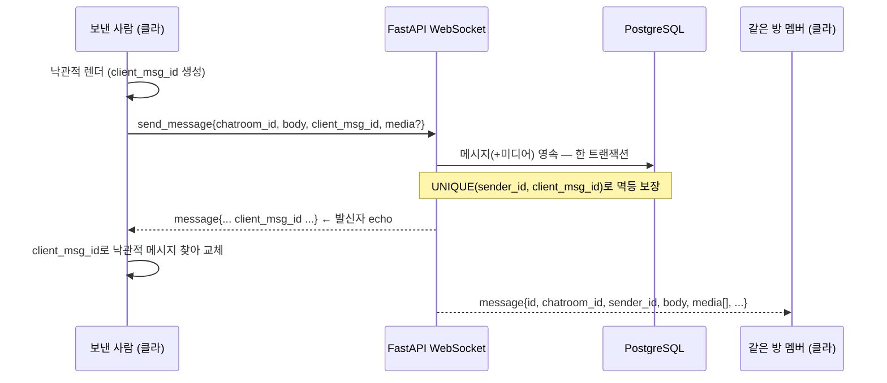
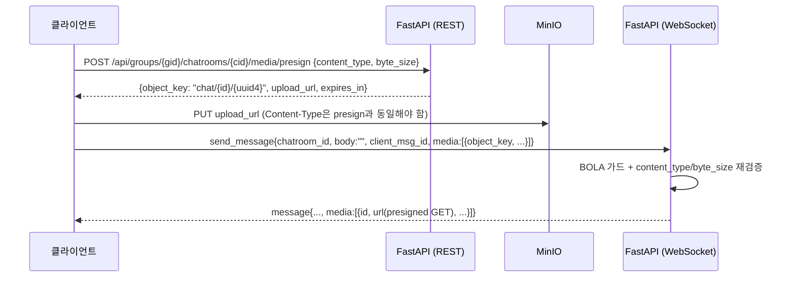
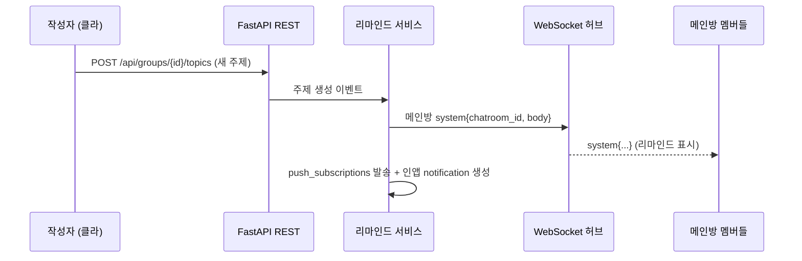

# API 계약 (REST + WebSocket)

백엔드 FastAPI가 노출하는 REST 엔드포인트와 실시간 WebSocket 프로토콜, 인증 모델을 정리한 계약 문서다.

> 갱신 2026-08-05 (v2 M3까지 반영) · 최초 v1 2026-06-16
>
> 아래 표가 모든 라우트를 담지는 않는다(실제 등록된 라우트는 37개). 목록의 진실은 코드이며,
> 런타임에서 `GET /api/docs`(OpenAPI)로 확인할 수 있다. 이 문서는 **계약과 시맨틱**을 다룬다.

## 개요

- **REST**: 동기 자원 조작(인증·그룹·주제·미디어·알림)에 사용한다. JSON 요청/응답.
- **WebSocket**: 채팅 메시지 송수신과 리마인드 시스템 메시지처럼 실시간성이 필요한 흐름에 사용한다.
- **경로 prefix**: 백엔드로 가는 모든 경로는 `/api`로 시작한다 — REST는 `/api/...`, WebSocket은 `/api/ws`. 배포의 Caddy는 `/api/*`만 FastAPI로 프록시하고 나머지는 SvelteKit SPA로 폴백하므로([deployment](./deployment.md)), 이 prefix가 일치해야 로그인 콜백·그룹 API·채팅 연결이 백엔드에 도달한다.
- 스택·배포·데이터 모델 상세는 [tech-stack](./tech-stack.md), [deployment](./deployment.md), [data-model](./data-model.md)를 참고한다. 제품 개요는 [README](../README.md)에 있다.

인증 모델 요약은 [인증 모델](#인증-모델) 절을 참고한다. 표의 "인증" 열은 호출에 유효한 JWT(httpOnly 쿠키)가 필요한지 여부다.

## REST 엔드포인트

### auth — 인증

| 메서드 | 경로 | 설명 | 인증 |
|---|---|---|---|
| GET | `/api/auth/{provider}/login` | OAuth 로그인 시작 (provider: kakao \| google) | 불필요 |
| GET | `/api/auth/{provider}/callback` | OAuth 콜백 처리 후 JWT를 httpOnly 쿠키로 발급 (`Set-Cookie`) | 불필요 |
| POST | `/api/auth/logout` | 세션 종료, 쿠키 무효화 | 필요 |

### me — 내 프로필

| 메서드 | 경로 | 설명 | 인증 |
|---|---|---|---|
| GET | `/api/me` | 현재 사용자 정보 조회 | 필요 |
| PATCH | `/api/me` | 닉네임·아바타 수정 | 필요 |

### groups · invites — 그룹·초대

| 메서드 | 경로 | 설명 | 인증 |
|---|---|---|---|
| POST | `/api/groups` | 그룹 생성 (이름). 생성자는 owner | 필요 |
| GET | `/api/groups` | 내가 멤버인 그룹 목록 | 필요 |
| GET | `/api/groups/{id}` | 그룹 상세. 비멤버는 403 | 필요 (멤버) |
| POST | `/api/groups/{id}/invites` | 초대코드/링크 생성 (만료·사용횟수) | 필요 (owner) |
| POST | `/api/invites/{code}/join` | 초대코드로 그룹 참여. 만료/초과 시 거부 | 필요 |
| PATCH | `/api/groups/{id}` | 그룹 이름 수정 (1~128자) | 필요 (owner) |
| DELETE | `/api/groups/{id}` | 그룹 soft-delete (`deleted_at` 세팅) | 필요 (owner) |
| DELETE | `/api/groups/{id}/members/{user_id}` | 멤버 제거(owner가 타인 대상) 또는 본인 탈퇴(`user_id`=본인) | 필요 (owner 또는 본인) |
| PATCH | `/api/groups/{id}/members/{user_id}` | 역할 변경 — `role:"owner"`는 소유권 이양(역할 맞교환). owner 강등은 불가(409), member 대상 `role:"member"`는 no-op | 필요 (owner) |

> **오너 관리 시맨틱**: 그룹 이름 수정·삭제·멤버 제거·소유권 이양은 모두 owner만 가능하고, 비owner가 호출하면
> 403이다. soft-delete된 그룹(`deleted_at` not null)은 멤버 목록·주제·채팅·초대 등 멤버십을 요구하는 **모든**
> 경로(WebSocket 포함)에서 존재하지 않는 것처럼 404로 취급된다. 멤버 제거·본인 탈퇴가 성공하면 대상의 살아있는
> WebSocket 연결이 즉시 축출된다(close code `4001`). owner는 소유권을 먼저 이양하지 않고는 자신을 제거하거나
> 탈퇴할 수 없다(409). 소유권 이양(`PATCH .../members/{user_id}` with `role:"owner"`)은 actor·target의 역할을
> 맞바꾸며, 이미 owner인 대상을 다시 이양 대상으로 지정하거나 현재 owner를 `role:"member"`로 낮추려 하면 409,
> 이미 member인 대상에게 `role:"member"`를 보내면 no-op(204)로 조용히 성공한다.

### topics · media · tags — 잼얘 시드·enrich

| 메서드 | 경로 | 설명 | 인증 |
|---|---|---|---|
| POST | `/api/groups/{gid}/topics` | 주제 시드 등록 (title만, status=seed) | 필요 (멤버) |
| PATCH | `/api/groups/{gid}/topics/{tid}` | enrich: 본문 추가 (status=enriched). 작성자만 | 필요 (작성자) |
| GET | `/api/groups/{gid}/topics?cursor=&date=` | 일별 타임라인 (cursor 페이지네이션) | 필요 (멤버) |
| GET | `/api/groups/{gid}/topics/{tid}` | 주제 상세 (본문·미디어·태그, 미디어 URL은 단기 presigned GET) | 필요 (멤버) |
| POST | `/api/groups/{gid}/topics/{tid}/media/presign` | MinIO presigned PUT URL 발급 (이미지 MIME allowlist + 10MiB 이하) | 필요 (작성자) |
| POST | `/api/groups/{gid}/topics/{tid}/media/confirm` | 업로드 확정 (object_key 형식·MIME 재검증 후 치수 등록) | 필요 (작성자) |
| PUT | `/api/groups/{gid}/topics/{tid}/tags` | ai/user 태그 동기화 | 필요 (작성자) |

### chat — 채팅 히스토리

| 메서드 | 경로 | 설명 | 인증 |
|---|---|---|---|
| GET | `/api/groups/{gid}/chatrooms/{cid}/messages?cursor=` | 채팅방 메시지 히스토리 (cursor 페이지네이션). 각 메시지에 `media[]` 포함 | 필요 (멤버) |
| POST | `/api/groups/{gid}/chatrooms/{cid}/read` | 읽음 처리 (`up_to`까지) | 필요 (멤버) |
| POST | `/api/groups/{gid}/chatrooms/{cid}/media/presign` | 채팅 첨부 업로드 URL 발급 (사진·동영상) | 필요 (멤버) |
| GET | `/api/groups/{gid}/chatrooms/{cid}/media/{mid}/url` | 만료된 첨부의 조회 URL 재발급 (단건) | 필요 (멤버) |
| GET | `/api/groups/{gid}/chatrooms/{cid}/media/{mid}/download` | 첨부 다운로드 — 서명된 URL로 **307 리다이렉트** | 필요 (멤버) |

> 실시간 메시지 송수신은 REST가 아니라 WebSocket으로 처리한다. 이 엔드포인트는 입장 시점의 과거 메시지 로딩과 재연결 후 재동기화 용도다.
> 첨부는 presign만 REST이고, **confirm 단계는 없다** — 업로드 후 메타데이터를 WS `send_message` 프레임에 실어 보낸다(아래 "채팅 미디어 첨부 흐름").

### push — 푸시 구독

| 메서드 | 경로 | 설명 | 인증 |
|---|---|---|---|
| GET | `/api/push/vapid-public-key` | VAPID 공개키 조회 (미설정 시 빈 문자열) | 불필요 |
| POST | `/api/push/subscribe` | Web Push 구독 등록 (endpoint, p256dh, auth) | 필요 |
| DELETE | `/api/push/subscribe` | 구독 해제 (`{endpoint}` 지정 시 해당 기기만, 생략 시 전체) | 필요 |

> **흐름**: 클라이언트가 `GET /api/push/vapid-public-key`로 공개키를 받아 브라우저 알림 권한을 요청하고,
> 승인되면 `PushManager.subscribe(applicationServerKey=...)`로 얻은 구독 정보를 `POST /api/push/subscribe`로
> 등록한다. 발송은 **새 주제 등록**·**안 읽은 채팅 발생** 이벤트에서 요청/WS 흐름을 막지 않는
> **fire-and-forget**으로 트리거되며, 페이로드는 `{title, body, url}` 고정 계약이다(서비스워커가 그대로
> 알림에 렌더링하고 클릭 시 `url`로 이동). 만료·해지된 구독(푸시 서비스가 404/410 응답)은 발송 시점에
> 자동으로 정리(prune)된다. `VAPID_PRIVATE_KEY`/`VAPID_PUBLIC_KEY`가 설정되지 않으면 발송은 조용히
> no-op(데모 무중단)이고, `GET .../vapid-public-key`도 빈 문자열을 반환해 프론트가 구독 토글을 숨긴다.

### notifications — 인앱 알림

| 메서드 | 경로 | 설명 | 인증 |
|---|---|---|---|
| GET | `/api/notifications` | 인앱 알림 목록 (읽음/안읽음) | 필요 |
| POST | `/api/notifications/{id}/read` | 알림 읽음 처리 | 필요 |

## 요청/응답 예시

### POST /api/groups/{id}/topics — 주제 시드 등록

생각났을 때 제목만으로 가볍게 던져두는 흐름이다. 본문·사진은 없어도 된다.

```json
// 요청
{ "title": "어제 본 그 영화 결말 다들 어떻게 해석함?" }

// 응답 201
{
  "id": "tpc_01HX...",
  "group_id": "grp_01HX...",
  "author_id": "usr_01HX...",
  "title": "어제 본 그 영화 결말 다들 어떻게 해석함?",
  "body": null,
  "status": "seed",
  "created_at": "2026-06-16T09:12:00Z",
  "updated_at": "2026-06-16T09:12:00Z"
}
```

### PATCH /api/groups/{gid}/topics/{tid} — enrich

나중에 본문을 붙이면 상태가 `enriched`로 바뀐다. 작성자만 수정할 수 있다.

```json
// 요청
{ "body": "특히 마지막 5분이 회상인지 현재인지 애매한데..." }

// 응답 200
{
  "id": "tpc_01HX...",
  "status": "enriched",
  "body": "특히 마지막 5분이 회상인지 현재인지 애매한데...",
  "updated_at": "2026-06-16T11:40:00Z"
}
```

### 미디어 업로드/조회 흐름

주제 이미지는 실제 오브젝트 스토리지(MinIO, S3 호환)에 저장한다. 클라이언트는 presign으로 발급받은 URL로 MinIO에 직접 PUT 업로드한 뒤, `POST /api/groups/{gid}/topics/{tid}/media/confirm`으로 확정(confirm)한다. 조회는 `GET /api/groups/{gid}/topics/{tid}` 응답의 `media[].url`이 매 요청마다 새로 발급되는 **단기(600초) presigned GET**이다 — 버킷이 프라이빗이라 서명 없는 URL로는 접근할 수 없다(정책 B). `MINIO_ACCESS_KEY`/`MINIO_SECRET_KEY`가 설정되지 않은 로컬 데모 환경에서는 presign 발급·미디어 조회 모두 서명 없는 결정적 로컬 fallback URL을 반환한다([tech-stack](./tech-stack.md), [deployment](./deployment.md) 참고).

`content_type`/`byte_size`는 presign과 confirm 양쪽에서 동일하게 검증한다: 이미지 MIME allowlist(`image/gif`, `image/jpeg`, `image/png`, `image/webp`)만 허용하고, `byte_size`는 10MiB(10,485,760바이트)를 넘으면 422를 반환한다. confirm은 추가로 `object_key`가 presign이 발급한 형식(`topics/{topic_id}/{uuid4}`)인지 검사해, 다른 topic이나 다른 요청에서 관찰한 object_key를 재사용하려는 시도를 422로 거부한다(BOLA 방지).

### POST /api/groups/{gid}/topics/{tid}/media/presign — 업로드 URL 발급

`upload_url`에는 `content_type`·`byte_size`가 서명에 바인딩돼 있어, 실제 PUT 요청의 `Content-Type`/`Content-Length`가 일치하지 않으면 MinIO가 업로드를 거부한다.

```json
// 요청
{ "content_type": "image/webp", "byte_size": 184320 }

// 응답 200
{
  "object_key": "topics/tpc_01HX/018f2e6a-4b1e-7c3a-9c2d-6a1b2c3d4e5f",
  "upload_url": "https://minio.example/jamye/topics/tpc_01HX/018f2e6a-4b1e-7c3a-9c2d-6a1b2c3d4e5f?X-Amz-Signature=...",
  "expires_in": 3600
}

// content_type이 allowlist 밖이거나 byte_size가 10MiB를 넘으면 422
```

### POST /api/groups/{gid}/topics/{tid}/media/confirm — 업로드 확정

```json
// 요청
{
  "object_key": "topics/tpc_01HX/018f2e6a-4b1e-7c3a-9c2d-6a1b2c3d4e5f",
  "content_type": "image/webp",
  "width": 1080,
  "height": 1350,
  "byte_size": 184320
}

// 응답 201
{
  "id": "med_01HX...",
  "topic_id": "tpc_01HX...",
  "type": "image/webp",
  "object_key": "topics/tpc_01HX/018f2e6a-4b1e-7c3a-9c2d-6a1b2c3d4e5f",
  "width": 1080,
  "height": 1350,
  "byte_size": 184320,
  "created_at": "2026-06-16T09:20:00Z"
}

// object_key가 topics/{topic_id}/{uuid4} 형식이 아니거나(다른 topic 소속 등) content_type/byte_size가
// 허용 범위를 벗어나면 422
```

## WebSocket 프로토콜

### 엔드포인트와 인증

```
/api/ws
```

REST와 **동일하게 httpOnly 쿠키의 JWT로 인증한다**. WebSocket 핸드셰이크도 HTTP 요청이고 `/api/ws`가 프론트엔드와 same-origin이므로, 브라우저가 쿠키를 자동으로 실어 보낸다. 서버는 핸드셰이크 시 쿠키의 JWT를 검증하고, 실패하면 즉시 연결을 close한다. 토큰을 쿼리스트링으로 넘기지 않으므로 JS가 토큰을 읽을 필요가 없고, ADR-4(토큰은 JS가 읽을 수 없는 httpOnly 쿠키)와 정합한다. 클라이언트는 `partysocket`으로 연결을 맺고 재연결·백오프와 heartbeat를 직접 관리한다(socket.io-client는 사용하지 않는다). 인증 모델 전반은 [인증 모델](#인증-모델)을 참고한다.

### client → server

| 메시지 | 페이로드 | 설명 |
|---|---|---|
| `join` | `{ chatroom_id }` | 채팅방 입장 (구독 시작). 이전 방은 서버가 자동으로 떠난다 — 별도 `leave`는 없다 |
| `send_message` | `{ chatroom_id, body, client_msg_id, media? }` | 메시지 전송. `client_msg_id`는 클라이언트가 생성하는 멱등 키로, 낙관적 렌더링과 중복 방지에 쓴다. 서버는 이 값을 `messages`에 저장하고 unique 제약으로 멱등성을 강제한다([data-model](./data-model.md)). **`media`가 있으면 `body`는 빈 문자열이어도 된다**(이미지 단독 메시지). 둘 다 비면 거부 |
| `ack` | `{ message_id }` | 클라이언트 수신 확인. 서버는 현재 아무 동작도 하지 않는다 |

### server → client

| 메시지 | 페이로드 | 설명 |
|---|---|---|
| `message` | `{ id, chatroom_id, sender_id, sender_nickname, sender_avatar_url, client_msg_id, body, msg_type, created_at, media[] }` | 일반 메시지. **발신자에게도 그대로 echo되며, 이것이 곧 전송 확정 신호다** — 별도 ack 메시지는 없다. 클라는 `client_msg_id`로 낙관적 메시지를 찾아 교체한다. `media`는 첨부가 없으면 빈 배열 |
| `duplicate` | `{ client_msg_id }` | 같은 `client_msg_id`로 재전송된 경우. 낙관적 메시지를 그대로 확정 처리하면 된다 |
| `transcript` | `{ chatroom_id, message_id, media_id, status, transcript }` | 음성 첨부의 **비동기 STT 결과** (`status`: `done` \| `failed`). 몇 분 전에 보낸 메시지에도 도착할 수 있으므로 클라는 `message_id`/`media_id`로 해당 미디어를 제자리 갱신한다 |
| `system` | `{ id?, chatroom_id?, body, created_at? }` | 시스템 메시지 (새 주제·첫 채팅 리마인드). `sender_id`는 null |
| `error` | `{ detail }` | 처리 실패 (권한 없음, 잘못된 방, 잘못된 미디어 페이로드 등) |

> **주의**: 메시지 타입 필드 이름이 방향마다 다르다 — 클라→서버는 봉투의 `type`이 메시지 종류이고,
> 서버→클라의 `message`에서는 봉투가 `type: "message"`이므로 **메시지 본문의 종류는 `msg_type`**
> (`user` \| `system`)으로 실려 온다.
>
> `presence`(접속 표시)와 `typing`(입력 중 표시)은 2차 범위다. 1차에서는 전송하지 않는다.

### 흐름 1 — 메시지 전송 → echo → 브로드캐스트


```mermaid
sequenceDiagram
    participant A as 보낸 사람 (클라)
    participant WS as FastAPI WebSocket
    participant DB as PostgreSQL
    participant B as 같은 방 멤버 (클라)

    A->>A: 낙관적 렌더 (client_msg_id 생성)
    A->>WS: send_message{chatroom_id, body, client_msg_id, media?}
    WS->>DB: 메시지(+미디어) 영속 — 한 트랜잭션
    Note over WS,DB: UNIQUE(sender_id, client_msg_id)로 멱등 보장
    WS-->>A: message{... client_msg_id ...}  ← 발신자 echo
    A->>A: client_msg_id로 낙관적 메시지 찾아 교체
    WS-->>B: message{id, chatroom_id, sender_id, body, media[], ...}
```

> **확정 신호는 별도 ack가 아니라 발신자에게 되돌아오는 `message` echo다.** 클라는 그 안의
> `client_msg_id`로 낙관적 메시지를 찾아 서버 버전으로 교체한다.
>
> 재연결 후 echo를 못 받아 같은 `client_msg_id`로 재전송하면, DB unique 제약에 걸려 중복 영속이
> 막히고 서버는 `duplicate{client_msg_id}`를 돌려준다.

### 흐름 3 — 채팅 미디어 첨부 (사진·동영상)

주제 미디어(presign → PUT → **confirm**)와 달리, 채팅 첨부는 **confirm이 없다**. `message_media.message_id`가
FK라 confirm 시점에 메시지가 아직 없어 고아 행이 생기기 때문이다. 대신 업로드 후 메타데이터를
`send_message` 프레임에 실어 보내고, 서버가 메시지 행과 미디어 행을 **한 트랜잭션**에서 만든다.


```mermaid
sequenceDiagram
    participant C as 클라이언트
    participant API as FastAPI (REST)
    participant S as MinIO
    participant WS as FastAPI (WebSocket)

    C->>API: POST /api/groups/{gid}/chatrooms/{cid}/media/presign {content_type, byte_size}
    API-->>C: {object_key: "chat/{id}/{uuid4}", upload_url, expires_in}
    C->>S: PUT upload_url (Content-Type은 presign과 동일해야 함)
    C->>WS: send_message{chatroom_id, body:"", client_msg_id, media:[{object_key, ...}]}
    WS->>WS: BOLA 가드 + content_type/byte_size 재검증
    WS-->>C: message{..., media:[{id, url(presigned GET), ...}]}
```

**요청 — `POST /api/groups/{gid}/chatrooms/{cid}/media/presign`**

```json
{ "content_type": "image/jpeg", "byte_size": 234567 }
```

**응답 201**

```json
{ "object_key": "chat/9f2c.../3b1e...", "upload_url": "https://minio.../...", "expires_in": 900 }
```

**WS `send_message`의 `media` 항목**

```json
{ "object_key": "chat/9f2c.../3b1e...", "content_type": "image/jpeg",
  "width": 1024, "height": 768, "byte_size": 234567, "duration": null }
```

**제약**

| 항목 | 값 |
|---|---|
| 허용 MIME | `image/jpeg` · `image/png` · `image/webp` · `image/gif` · `video/mp4` · `audio/webm` · `audio/mp4` · `audio/ogg` |
| 이미지 최대 | 10 MiB |
| 동영상 최대 | **50 MiB** (presigned PUT이 통과하는 Cloudflare 무료 플랜 100MB 본문 제한 고려) |
| 오디오 최대 | 15 MiB (클라 녹음 상한 5분) |
| 메시지당 개수 | 최대 4. **단, 오디오는 단독 1개만**(음성 메시지 = 오디오 첨부 1개를 가진 일반 메시지) |
| 위반 시 | presign은 422, WS는 `{"type":"error","detail":...}` |

- **BOLA 가드**: `object_key`는 `chat/{chatroom_id}/{uuid4}` 형식(단일 세그먼트)이어야 한다. 타 채팅방에서
  발급된 키를 첨부하려는 시도는 거부된다.
- 클라이언트가 보낸 `content_type`·`byte_size`는 **서버가 재검증**한다.
- 조회 URL은 접근 정책 B의 단기 presigned GET(600초)이다. 채팅 화면은 오래 열려 있어 세션 도중 만료되므로,
  클라이언트는 로드 실패 시 `GET .../media/{mid}/url`로 **해당 첨부 하나만** 재발급받는다.
  히스토리 페이지 재조회로는 안 된다 — 스크롤로 불러온 옛 메시지는 최신 페이지에 없어서 영영 복구되지 않는다.
  첨부당 재시도 횟수는 제한한다(객체가 실제로 사라진 경우 무한 루프 방지).
- 한 메시지의 첨부 순서는 `position` 컬럼으로 보존한다. 같은 트랜잭션에서 삽입돼 `created_at`이 동일하므로,
  이 컬럼이 없으면 정렬이 랜덤 uuid로 넘어가 **히스토리를 다시 불러올 때마다 순서가 뒤바뀐다**.

**다운로드 — `GET .../media/{mid}/download`**

미디어는 앱과 다른 오리진(MinIO)에 있어 HTML `download` 속성이 무시된다. 그래서 저장을 강제하려면
**서명에 `response-content-disposition: attachment`를 넣어야** 한다. 이를 히스토리 응답마다 URL 2개로
내려보내는 대신 리다이렉트 엔드포인트로 처리한다 — payload가 늘지 않고, **클릭 시점에 권한을 다시 검증**한다.

- 멤버십 + 채팅방-그룹 소속 확인 후, `media_id`가 **이 채팅방의 메시지에 속하는지 조인으로 재확인**한다.
  이 조인이 인가 그 자체다. 없으면 `media_id` 추측만으로 아무 그룹의 첨부나 받아갈 수 있다(IDOR).
- 파일명은 원본을 저장하지 않으므로 `jamye-{media_id}.{ext}`로 생성한다.
- **307**을 쓴다(캐시되지 않음). 대상 URL은 수 분 내 만료되므로 재사용되면 안 된다.

### 흐름 4 — 음성 메시지 + 비동기 전사 (M4a)

별도 메시지 타입은 없다 — **음성 메시지 = 오디오 첨부 1개를 가진 일반 메시지**다. 업로드는 흐름 3과
동일하고(브라우저 MediaRecorder 녹음 → presign → PUT → `send_message`에 동봉), 전사만 비동기로 붙는다.

```
[전송 시] REDIS_URL이 설정돼 있으면 message_media.transcript_status = "pending" + arq 큐잉
[워커]   MinIO에서 오디오 fetch → faster-whisper(language="ko", vad_filter, int8)
         → transcript 저장(done|failed) → Redis `jamye:transcripts` publish
[백엔드] lifespan 구독자가 WS `transcript` 프레임으로 채팅방에 broadcast
```

- **REDIS_URL이 없으면 전사가 조용히 생략된다**(`transcript_status`는 NULL 유지) — 음성 메시지
  자체는 정상 전송·재생된다. 데모/개발 환경의 문서화된 fallback이다.
- 워커는 별도 프로세스라 백엔드의 인메모리 ws_hub에 닿을 수 없다 — Redis 채널이 그 브리지다.
- 전사 실패는 `status: "failed"`로 도착하고 행에도 남는다(영원히 "받아쓰는 중"으로 남지 않음).
- MIME별 녹음 주체: Chrome은 `audio/webm`(opus), iOS Safari는 `audio/mp4`(AAC), Firefox는
  `audio/ogg`. faster-whisper가 셋 다 PyAV로 직접 디코딩하므로 서버 트랜스코딩은 없다.

### 흐름 2 — 새 주제 → 리마인드 시스템 메시지

새 주제가 등록되거나 주제방에 첫 채팅이 달리면, 서버가 그룹 메인 채팅방에 시스템 메시지를 브로드캐스트하고 동시에 Web Push·인앱 알림을 발송한다 (T11 리마인드 시스템). 알림 발송 경로는 [tech-stack](./tech-stack.md)의 Web Push 절을 참고한다.


```mermaid
sequenceDiagram
    participant U as 작성자 (클라)
    participant API as FastAPI REST
    participant SVC as 리마인드 서비스
    participant WS as WebSocket 허브
    participant M as 메인방 멤버들

    U->>API: POST /api/groups/{id}/topics (새 주제)
    API->>SVC: 주제 생성 이벤트
    SVC->>WS: 메인방 system{chatroom_id, body}
    WS-->>M: system{...} (리마인드 표시)
    SVC->>SVC: push_subscriptions 발송 + 인앱 notification 생성
```

## 인증 모델

- **REST**: OAuth 콜백에서 발급한 JWT를 **httpOnly 쿠키**로 전달한다. 브라우저가 자동으로 쿠키를 실어 보내고, FastAPI가 매 요청에서 JWT를 검증한다.
- **WebSocket**: REST와 **동일하게 httpOnly 쿠키의 JWT**로 인증한다. `/api/ws`가 same-origin이라 핸드셰이크에 쿠키가 자동 포함되고, 서버가 이를 검증해 실패 시 close한다. 토큰을 쿼리스트링이나 JS에 노출하지 않는다(쿼리 토큰 방식을 쓰지 않는 이유: ADR-4의 httpOnly 쿠키 원칙과 충돌하기 때문).
- **2중 방어**: SPA 클라이언트 가드는 UX(라우팅·리다이렉트)를 담당하고, 실보안은 FastAPI의 JWT 검증(401/403)이 담당한다. 클라이언트 가드만으로 자원을 보호하지 않는다.

상세 토큰 수명·OAuth provider 설정은 [tech-stack](./tech-stack.md)를 참고한다.
