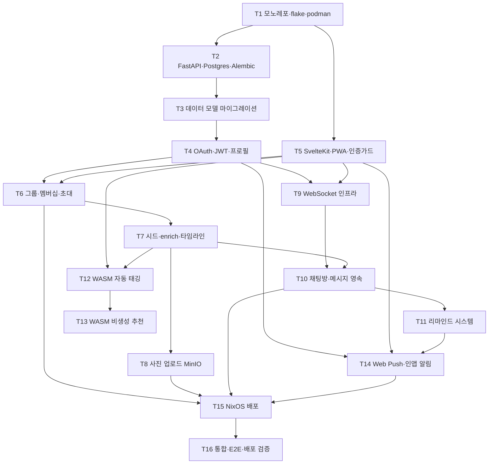

# 마일스톤 (Milestones)

v1 구현을 **마일스톤** 기준으로 재정비한 진행 문서다. 구 `tasks.md`(T1~T16)를 흡수·대체하며, 구현 순서의 SSOT 역할을 한다.

> 버전 v1 · 갱신 2026-06-17

제품 개요는 [README](../README.md), 기능 명세는 [features](../product/features.md), API·AI 설계는 [architecture](../architecture/) 디렉터리를 참고한다.

## 현재 상태 (2026-06-17)

- **PR #1** (기획 docs) 머지 — 기획·아키텍처 문서 확정.
- **PR #2** (v1 백본) 머지 — FastAPI(router/service/repository) + 모델 11개 + 그룹/멤버십/초대/권한 + 토픽 시드·enrich + 주제별/메인 채팅방·실시간 WS·메시지 영속·히스토리 + 새 주제 리마인드 + OAuth 골격(dev 스텁) + push 구독 엔드포인트. 리뷰 29 스레드 반영.
- **평가**: 데이터·채팅·그룹 **백본은 견고**하나, 일부 기능은 UX 루프가 닫혀 있지 않거나(초대 참여·주제 enrich·인앱 알림 화면 미연결) 외부 키/추가 구현이 필요(실 OAuth·사진·Web Push 발송·온디바이스 AI). → 마일스톤 M0부터 **1차 스코프 완성**에 집중한다.

## 진행 원칙

1. **배포(NixOS) 전에 1차 스코프 기능 개발을 완료**하고, **사용자가 직접 사용성 테스트**를 마쳐야 한다 (필수 게이트).
2. 외부 키 의존(카카오·구글 OAuth 클라이언트, S3/MinIO 운영 키)과 self 가능(VAPID 자체 생성, 온디바이스 AI)을 구분해 순서를 잡는다. 키가 없어도 dev 스텁/로컬 인프라로 개발을 막지 않는다.
3. 1차에서는 생성형 LLM(wllama)·Redis·정교한 presence를 제외한다(MVP). 살 붙이기는 **비생성 추천**으로 확정.

---

## 마일스톤 개요

| 마일스톤 | 목표 | 관련 태스크 | 상태 |
|---|---|---|---|
| **M0** | 1차 기능 완성 & QA (+실 OAuth) | T2·T3·T4·T5·T6·T7·T10·T14(인앱) | 진행 예정 |
| **M1** | 사진 업로드 | T8 | 대기 |
| **M2** | 알림 완성 | T11·T14(발송) | 대기 |
| **M3** | 온디바이스 AI | T12·T13 | 대기 |
| **M4** | 마감·품질 → ✋ 사용성 테스트 | T16(핵심) | 대기 |
| **배포** | NixOS 배포 (테스트 통과 후) | T15·T16(E2E) | 대기 |

---

## M0 — 1차 기능 완성 & QA (+실 OAuth)  ⟨최우선⟩

"완료"로 표시된 백본 기능들의 **UX 루프를 끝까지 닫고**, 실 로그인까지 포함해 사용자가 실제로 써볼 수 있는 상태로 만든다.

| # | 항목 | 내용 | 관련 T |
|---|---|---|---|
| ① | 실 OAuth 콜백 | 카카오·구글 `code→token→profile→user upsert`. 키 없으면 기존 dev 스텁 유지(501 제거) | T4 |
| ② | 채팅 발신자 정보 | `MessageOut`·WS payload·히스토리에 `sender_nickname`/`avatar` 포함 + FE 렌더(상대/본인 구분) | T10 |
| ③ | 초대 참여 화면 | 코드 입력 → `joinByCode` → 그룹 진입 (현재 헬퍼만 존재) | T6 |
| ④ | 주제 enrich UI | 상세 페이지에 텍스트 입력·저장(`enrichTopic`), author/owner 게이트, enriched 배지 | T7 |
| ⑤ | 인앱 알림 화면 | 목록 + 읽음 처리(`listNotifications`/`markRead`), 진입점 | T14(인앱) |
| ⑥ | 일별 타임라인 + 무한스크롤 | 그룹 상세 타임라인 날짜별 그룹핑 + cursor 무한스크롤 (백엔드 준비됨) | T7 |
| ⑦ | Alembic 도입 | `create_all` 스텁 → 정식 마이그레이션(async env.py + 최초 autogenerate + upgrade) | T2·T3 |
| ⑧ | PWA 재활성 + 온보딩 | vite 정렬로 `@vite-pwa/sveltekit` 복구, 로그인→온보딩(닉네임)→앱 플로우 점검 | T5 |
| ⑨ | QA | FE 타입에러(`page.params`) 정리, 핵심 화면 접근성/반응형/로딩·에러 상태, 핵심 플로우 pytest | T16(부분) |

> 선행(사용자): 카카오·구글 OAuth 클라이언트 키. **코드는 키 없이 먼저 구현**, 키는 이후 `.env` 주입으로 활성화(그동안 dev 스텁).

## M1 — 사진 업로드

- 로컬 MinIO(podman) 기동 + presigned PUT 실경로 구현(스텁 대체).
- FE: 크롭(`svelte-easy-crop`) + 압축(`browser-image-compression`) → presign → PUT → confirm → 표시.
- 관련: **T8**.

## M2 — 알림 완성

- **첫 채팅 리마인드** 트리거(주제방 첫 메시지 → 그룹 메인방 system 메시지 + 알림).
- **Web Push 발송**: VAPID 자체 생성, `pywebpush`, 구독 토글 UI, iOS 홈화면 추가 설치 유도 + 인앱 fallback.
- 관련: **T11**, **T14(발송)**. 선행: PWA(M0 ⑧).

## M3 — 온디바이스 AI (WASM)

- **자동 태깅**: `multilingual-e5-small`(int8) 임베딩 zero-shot, Web Worker 추론, Cache/OPFS 모델 캐시, COOP/COEP 헤더.
- **살 붙이기 비생성 추천**: e5 재사용 + 질문 뱅크 임베딩 추천(추가 다운로드 0).
- 관련: **T12**, **T13**. 독립적이라 M1/M2와 병렬 가능.

## M4 — 마감·품질 → 사용성 테스트

- shadcn-svelte 정합(선택), 접근성·반응형 최종 점검, 핵심 플로우 pytest/통합 테스트.
- **→ ✋ 사용자 직접 사용성 테스트 (필수 게이트)** — 통과해야 배포로 진행.
- 관련: **T16(핵심)**.

## 배포 (사용성 테스트 통과 후)

- **T15**: NixOS flake(인프라 native + 앱 podman OCI) + sops-nix 시크릿 + Caddy(자동 ACME·WS 패스스루·COOP/COEP) + cloudflared 터널.
- **T16(E2E)**: 통합·E2E·배포 검증.
- 설계 상세는 [deployment](../architecture/deployment.md) 참고.

---

## 부록 A — 태스크 매핑 (구 `tasks.md` T1~T16)

기존 태스크 분해를 보존하고 마일스톤·상태와 매핑한다. 상태: 🟢 완료 · 🟡 부분 · 🔴 미착수.

| id | 에픽 | 제목 | 마일스톤 | 상태 |
|---|---|---|---|---|
| T1 | 기반 | 모노레포 + nix flake devshell + podman 이미지 | 배포 | 🟡 모노레포✅ / flake·앱이미지❌ |
| T2 | 기반 | FastAPI 구조 + Postgres + Alembic | M0 | 🟡 구조·DB✅ / Alembic❌ |
| T3 | 기반 | 데이터 모델 마이그레이션(전체 엔티티) | M0 | 🟡 모델✅ / 마이그레이션❌ |
| T4 | E1 | 카카오·구글 OAuth + JWT 쿠키 + `/api/me` + 프로필 | M0 | 🟡 골격·스텁✅ / 실 OAuth❌ |
| T5 | 기반 | SvelteKit SPA + Tailwind + shadcn-svelte + PWA + 인증가드 | M0 | 🟡 SPA·Tailwind·가드✅ / shadcn·PWA❌ |
| T6 | E2 | 그룹 CRUD + 멤버십 + 초대코드/링크 + 권한 | M0 | 🟢 백엔드✅ / 초대 참여 UI❌ |
| T7 | E3 | 잼얘 시드 + enrich(텍스트) + 일별 타임라인(무한스크롤) | M0 | 🟡 시드·enrich✅ / 타임라인 FE❌ |
| T8 | E3 | 사진 업로드(MinIO presigned PUT + 크롭/압축) | M1 | 🔴 |
| T9 | E5 | WebSocket 인프라(FastAPI WS + 방참여/메시지/ack) | — | 🟢 (partysocket 미사용, native WS) |
| T10 | E5 | 주제별 + 그룹 메인 채팅방 + 메시지 영속·히스토리 | M0 | 🟢 / 발신자 표시 잔여 |
| T11 | E5 | 리마인드(새 주제/첫 채팅 → 시스템 메시지 + 알림) | M2 | 🟡 새 주제✅ / 첫 채팅❌ |
| T12 | E3 | WASM 자동 태깅(Transformers.js + e5-small, Worker) | M3 | 🔴 |
| T13 | E5 | WASM 살 붙이기 비생성 추천(질문뱅크 + e5) | M3 | 🔴 |
| T14 | E6 | Web Push(VAPID, pywebpush) + 인앱 알림 + iOS 설치유도 | M0(인앱)·M2(발송) | 🟡 구독·인앱·발송✅ (v2 M1) / iOS❌ |
| T15 | 배포 | NixOS flake + 시크릿 + Caddy + cloudflared | 배포 | 🔴 |
| T16 | QA | 통합 테스트 + 핵심 E2E + 배포 검증 | M4·배포 | 🔴 |

## 부록 B — 의존성·트랙·동기 지점

### 병렬 트랙 (기반 이후 BE/FE 동시)
- **Backend**: T2 → T3 → T4 → T6 → T7 → T9 → T10 → T11 → T14(서버) → T15
- **Frontend**: T5 → T6 UI → T7 UI → T8 → T9 클라 → T10 UI → T12 → T13 → T14(클라)

### FE/BE 계약 동기 지점
| 지점 | 태스크 | 합쳐야 할 계약 |
|---|---|---|
| 그룹 | T6 | 그룹·멤버십·초대 REST 응답 형태와 권한(403) 규칙 |
| 채팅 | T10 | WS 메시지 타입(`join`/`send_message`/`message`/`system`)과 히스토리 페이지네이션 |
| 알림 | T14 | 푸시 구독 페이로드, 인앱 알림 목록·읽음, 리마인드 트리거 |

WS·REST 계약 상세는 [api-contract](../architecture/api-contract.md), WASM 태깅·추천 설계는 [on-device-ai](../architecture/on-device-ai.md) 참고.

### 의존성 그래프

## 부록 C — 미해결 질문 (open questions)

| 질문 | 현재 결정 |
|---|---|
| 그룹 인원 상한 | ✅ 기본 **12** 확정(`groups.max_members=12`) |
| 초대 링크 만료 정책 기본값 | 미정(만료·사용횟수 둘 다 지원, 무제한 기본). M0 ③에서 UI 정책 확정 |
| 태그 사전(고정 카테고리) vs 자유 태그 | 미정 — M3 태깅 설계 시 확정 |
| 살 붙이기 질문 뱅크 초기 시드 문항 | 미정 — M3 추천 설계 시 카테고리별 작성 |
