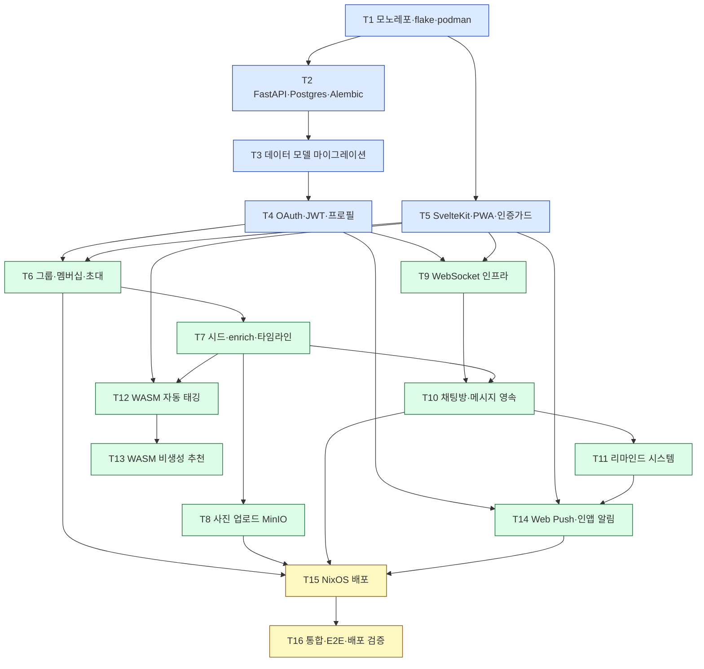

# 태스크 (T1~T16)

v1 구현 태스크 16개를 우선순위·의존성·병렬 트랙 기준으로 정리한 작업 문서다.

> 버전 v1 · 2026-06-16 · SSOT: plan.json

제품 개요는 [README](../README.md), 기능 명세는 [features](../product/features.md), API·AI 설계는 [architecture](../architecture/api-contract.md) 디렉터리를 참고한다.

## 태스크 목록

### P0 — 기반

| id | 에픽 | 제목 | 의존성 |
|---|---|---|---|
| T1 | 기반 | 모노레포 구조 + nix flake devshell + podman 이미지 스캐폴딩 | — |
| T2 | 기반 | FastAPI 구조(router/service/repository) + Postgres 연결 + Alembic | T1 |
| T3 | 기반 | 데이터 모델 마이그레이션 (전체 엔티티) | T2 |
| T4 | E1 | 카카오·구글 OAuth + JWT(httpOnly 쿠키) + /me + 프로필 | T3 |
| T5 | 기반 | SvelteKit(adapter-static SPA) + Tailwind + shadcn-svelte + PWA + 인증 가드/라우팅 | T1 |

### P1 — 핵심 기능

| id | 에픽 | 제목 | 의존성 |
|---|---|---|---|
| T6 | E2 | 그룹 CRUD + 멤버십 + 초대코드/링크 + 권한(서비스 레이어) | T4, T5 |
| T7 | E3 | 잼얘 시드 등록 + enrich(텍스트) + 일별 타임라인(무한스크롤) | T6 |
| T8 | E3 | 사진 업로드 (MinIO presigned PUT + 크롭/압축) | T7 |
| T9 | E5 | WebSocket 인프라 (FastAPI WS + partysocket + 방 참여/메시지/ack) | T4, T5 |
| T10 | E5 | 주제별 채팅방 + 그룹 메인 채팅방 + 메시지 영속·히스토리 | T9, T7 |
| T11 | E5 | 리마인드 시스템 (새 주제/첫 채팅 → 시스템 메시지 + 알림 트리거) | T10 |
| T12 | E3 | WASM 자동 태깅 (Transformers.js + e5-small, Web Worker, 모델 캐싱, COOP/COEP) | T5, T7 |
| T13 | E5 | WASM 살 붙이기 비생성 추천 (질문 뱅크 + e5 임베딩, e5 모델 공유) | T12 |
| T14 | E6 | Web Push (VAPID, 구독, pywebpush 발송) + 인앱 알림 + iOS 설치 유도 | T4, T5, T11 |

### P2 — 배포·마감

| id | 에픽 | 제목 | 의존성 |
|---|---|---|---|
| T15 | 배포 | NixOS flake (인프라 native + 앱 podman) + agenix 시크릿 + Caddy + cloudflared | T6, T8, T10, T14 |
| T16 | QA | 통합 테스트 + 핵심 플로우 E2E + 배포 검증 | T15 |

## 병렬 트랙

기반(T1)을 깔고 나면 Backend 트랙과 Frontend 트랙이 동시에 진행된다.

- **Backend 트랙**: T1 → T2 → T3 → T4 → T6 → T7 → T9 → T10 → T11 → T14(서버) → T15
- **Frontend 트랙**: T5 → (T6 UI) → T7 UI → T8 → T9 클라 → T10 UI → T12 → T13 → T14(클라)

### 동기 지점 (FE/BE 계약 합치)

두 트랙은 다음 지점에서 만나 API 계약을 맞춘다.

| 지점 | 태스크 | 합쳐야 할 계약 |
|---|---|---|
| 그룹 | T6 | 그룹·멤버십·초대 REST 응답 형태와 권한(403) 규칙 |
| 채팅 | T10 | WebSocket 메시지 타입(`send_message`/`message`/`message_ack`/`system`)과 히스토리 페이지네이션 |
| 알림 | T14 | 푸시 구독 페이로드, 인앱 알림 목록·읽음 처리, 리마인드 트리거 |

WebSocket·REST 계약 상세는 [api-contract](../architecture/api-contract.md), WASM 태깅·추천(T12·T13) 설계는 [on-device-ai](../architecture/on-device-ai.md)를 참고한다.

## 의존성 그래프

## 구현 전 미해결 질문 (open questions)

구현 착수 전에 값을 확정해야 하는 항목이다.

| 질문 | 현재 제안 |
|---|---|
| 그룹 인원 상한 정확한 값 | 기본 12 제안 |
| 초대 링크 만료 정책 기본값 | 미정 (만료·사용횟수 둘 다 지원) |
| 태그 사전(고정 카테고리) vs 자유 태그 추출 범위 | 미정 |
| 살 붙이기 질문 뱅크 초기 시드 문항 | 미정 (카테고리별로 작성 필요) |
