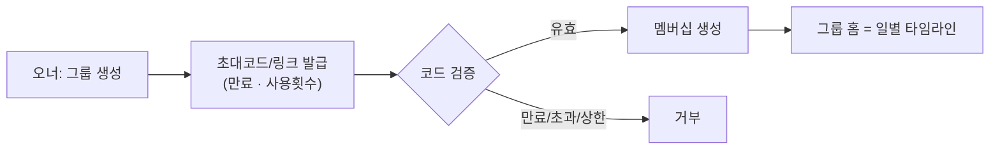
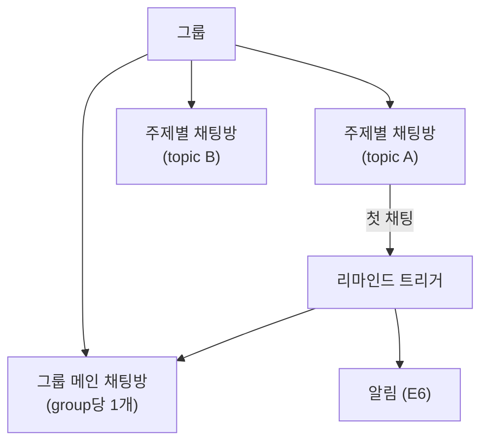

# 잼얘좀 — 기능 명세

7개 에픽(E1~E7)의 유저 스토리와 수용 기준을 정리한다. 잼얘좀은 폐쇄 그룹에서 주제를 시드로 던지고 그 주제로 실시간 채팅하는 PWA다.

> 버전 v1 · 2026-06-16 · SSOT: plan.json

---

## 에픽 개요

| 에픽 | 이름 | 한 줄 |
|------|------|-------|
| E1 | 인증·온보딩 | 카카오·구글 OAuth로 시작하고 프로필을 설정한다 |
| E2 | 그룹(폐쇄) | 초대코드/링크로 소수 폐쇄 그룹을 만들고 참여한다 |
| E3 | 잼얘 시드·enrich | 주제를 시드로 던지고 텍스트·사진으로 살을 붙인다 |
| E4 | 타임라인 | 그룹 잼얘를 날짜별로 본다 |
| E5 | 채팅(2층) | 주제별 방과 그룹 메인방에서 실시간으로 떠든다 |
| E6 | 알림 | 새 주제·채팅 시작을 푸시·인앱으로 받는다 |
| E7 | PWA | 홈 화면에 추가해 앱처럼 쓴다 |

비전·컨셉·스코프 전체는 [vision-and-scope](./vision-and-scope.md)를 참고한다.

---

## E1 인증·온보딩

| 유저 스토리 | 수용 기준 |
|-------------|-----------|
| 카카오/구글로 로그인해 빠르게 시작한다 | OAuth 콜백 → JWT(httpOnly 쿠키) 발급 → `/api/me` 조회 가능. 신규면 프로필 생성 플로우로 진입 |
| 닉네임·아바타를 설정한다 | 프로필 PATCH. 아바타는 MinIO 업로드(선택). 미설정 시 기본 아바타 |
| iOS에서 홈 화면 추가 안내를 받는다 | iOS Safari 감지 시 설치 가이드 모달(푸시의 전제 조건) |

> 인증은 클라이언트 가드(UX)와 FastAPI JWT 검증(실보안) 2중으로 동작한다.

---

## E2 그룹(폐쇄)

| 유저 스토리 | 수용 기준 |
|-------------|-----------|
| 그룹을 만들고 친구를 초대한다 | 그룹 생성(이름). 초대코드/링크 생성(만료·사용횟수). 오너 권한 |
| 초대 링크로 그룹에 참여한다 | 유효 코드 → 멤버십 생성. 만료/초과 시 거부. 인원 상한(기본 12) |
| 내 그룹 목록을 본다 | 멤버인 그룹만 노출. 비멤버는 그룹 리소스 403 |

---

## E3 잼얘 시드·enrich

| 유저 스토리 | 수용 기준 |
|-------------|-----------|
| 생각났을 때 주제만 빠르게 등록한다 | `title`만으로 topic 생성(`status=seed`). 본문·사진 없이 OK |
| 나중에 텍스트·사진을 추가한다 | `body` 추가, 사진 N장 업로드(presigned). `status=enriched`. 작성자만 수정 |
| 올리면 자동 태그가 붙는다 | 브라우저 WASM e5-small 임베딩 → zero-shot 분류 상위 N개 태그. `source=ai`, 사용자 수정 가능 |

시드 → enrich 2단계 콘텐츠 모델의 배경은 [vision-and-scope](./vision-and-scope.md), 자동 태깅 런타임은 [on-device-ai](../architecture/on-device-ai.md)를 참고한다.

---

## E4 타임라인

| 유저 스토리 | 수용 기준 |
|-------------|-----------|
| 그룹 잼얘가 날짜별로 쌓인 걸 본다 | 일별 그룹핑, 최신순, 무한 스크롤(cursor pagination). 태그·미디어 썸네일 표시 |

---

## E5 채팅(2층)

채팅은 두 층으로 나뉜다. 주제별 채팅방(그 주제 전용)과 그룹 메인 채팅방(그룹당 1개, 일반 대화 + 리마인드 허브).

| 유저 스토리 | 수용 기준 |
|-------------|-----------|
| 주제에 들어가 그것에 대해 실시간으로 떠든다 | 주제별 채팅방. WS 연결·방 참여·메시지 송수신·히스토리. 첫 채팅 시 리마인드 트리거 |
| 그룹 메인 채팅방에서 일반 대화한다 | 그룹당 1개 메인 채팅방. 일반 메시지 + 시스템 메시지(리마인드) |
| 후속 질문 추천을 받는다 | 브라우저 WASM 비생성: 질문 뱅크 + e5 임베딩 유사도 상위 3개 추천(편집 가능) |

> 실시간은 FastAPI native WebSocket ↔ 클라이언트 partysocket(재연결·백오프) + heartbeat. presence/typing 인디케이터는 1차에서 제외(기본). WS 프로토콜 상세는 [api-contract](../architecture/api-contract.md) 참고.

---

## E6 알림

| 유저 스토리 | 수용 기준 |
|-------------|-----------|
| 새 주제·채팅 시작 시 알림을 받는다 | 이벤트 → 그룹 멤버 `push_subscriptions`로 Web Push 발송 + 인앱 notification 생성 |
| 인앱 알림 목록을 본다 | 읽음/안읽음, 클릭 시 해당 리소스로 이동. 푸시 미지원 환경의 fallback |

> Web Push는 VAPID 자체 생성 + pywebpush 발송. iOS Web Push는 홈 화면에 추가한 PWA에서만 동작하므로, 설치 유도와 인앱 알림 fallback을 기본 제공한다.

---

## E7 PWA

| 유저 스토리 | 수용 기준 |
|-------------|-----------|
| 홈 화면에 추가해 앱처럼 쓴다 | manifest(아이콘·이름·standalone), service worker(injectManifest), 오프라인 셸, 설치 프롬프트 |

배포·헤더(COOP/COEP) 설정은 [deployment](../architecture/deployment.md)를 참고한다.

---

## 공통 규칙 (completeness 리뷰 반영)

기획 completeness 리뷰에서 추가된 횡단 규칙이다. 각 에픽 구현 시 함께 적용한다.

| 규칙 | 내용 |
|------|------|
| 주제·메시지 수정/삭제 권한 | 주제는 작성자, 그룹/관리 동작은 오너 권한 기준 |
| 그룹 인원 상한 | 기본 12명 (`groups.max_members` default 12) |
| 초대 만료·횟수 | 초대코드는 만료 시각(`expires_at`)과 사용횟수(`max_uses`/`used_count`)로 제한 |
| 기본 검증 | 입력 검증 — 프론트 zod, 백엔드 Pydantic |
| 메시지 멱등 전송 | `client_msg_id`로 낙관적 전송 + `message_ack`로 중복 방지 |

---

## 화면 ↔ 에픽 매핑

| 화면 (route) | 주 에픽 |
|--------------|---------|
| `/login` | E1 |
| `/onboarding` | E1 |
| `/groups` | E2 |
| `/groups/:id` (그룹 홈 = 일별 타임라인) | E4 |
| `/groups/:id/topics/:tid` (주제 상세 + enrich + 주제별 채팅) | E3, E5 |
| `/groups/:id/chat` (그룹 메인 채팅방) | E5 |
| `/groups/:id/invite` | E2 |
| `/notifications` | E6 |
| `/settings` (프로필·푸시 권한·PWA 설치) | E1, E6, E7 |

---

## 관련 문서

- [vision-and-scope](./vision-and-scope.md) — 비전·컨셉·스코프·로드맵
- [tech-stack](../architecture/tech-stack.md) — 기술 스택
- [data-model](../architecture/data-model.md) — 데이터 모델
- [api-contract](../architecture/api-contract.md) — REST + WebSocket 계약
- [on-device-ai](../architecture/on-device-ai.md) — WASM 온디바이스 AI
- [deployment](../architecture/deployment.md) — NixOS 하이브리드 배포
- [tasks](../planning/tasks.md) — 태스크 분해
- [프로젝트 README](../README.md)
