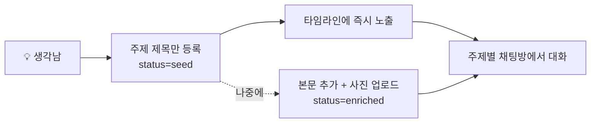
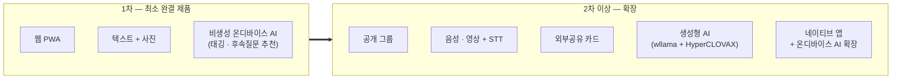

# 잼얘좀 — 비전 & 스코프

잼얘좀(jamye-plz)은 지인 폐쇄 그룹에서 일상의 재밌는 얘기를 던져두고, 그 주제로 실시간 채팅하며 노는 lightweight 소셜 플랫폼이다.

> 버전 v1 · 2026-06-16 · SSOT: plan.json

---

## 1. 제품 정체성

| 항목 | 내용 |
|------|------|
| 이름 | 잼얘좀 (jamye-plz) |
| 뜻 (KR) | "재밌는 얘기 좀" |
| 뜻 (EN) | "anything interesting?" |
| 한 줄 정의 | 지인 폐쇄 그룹에서 일상의 재밌는 얘기(주제)를 시드로 던지고, 점진적으로 살을 붙이며, 그 주제로 실시간 채팅하는 소셜 플랫폼 |
| 폼팩터 | 반응형 PWA 웹 (1차) |
| 목표 | 친구들이 실제로 쓰는 최소 완결 제품, 지인 규모 실서비스 |

---

## 2. 비전 & 컨셉

핵심 가치는 **"얘기"가 아니라 "그것에 대한 대화"** 다. 주제는 대화를 시작하기 위한 시드이고, 그 시드를 중심으로 모이는 실시간 채팅이 제품의 본체다.

```
폐쇄 그룹 (초대제 · 소수)
├─ 일별 타임라인: 잼얘(주제) "시드"가 날짜별로 누적
│    └─ 각 주제: 주제만 먼저 등록(부담 0) → 텍스트/사진으로 enrich
│         └─ 주제별 채팅방: 그 주제로 실시간 대화
└─ 그룹 메인 채팅방: 일반 채팅 + 리마인드 허브
🔔 알림 기반 참여유도   🫥 폐쇄 · 날것 감성
```

세 가지 설계 원칙:

- **부담 없는 시작** — 생각났을 때 주제 한 줄만 던져두면 된다. 본문도 사진도 나중에.
- **대화 중심** — 주제는 떡밥이고, 가치는 그 주제로 떠드는 실시간 채팅에서 나온다.
- **폐쇄 · 날것** — 아는 사람들끼리만, 꾸미지 않은 일상의 톤으로.

---

## 3. "시드 → enrich" 2단계 콘텐츠 모델

잼얘(주제)는 한 번에 완성하지 않는다. 등록 부담을 0으로 낮추기 위해 두 단계로 나뉜다.

| 단계 | status | 무엇을 | 조건 |
|------|--------|--------|------|
| 1. 시드 (seed) | `seed` | 제목(title)만으로 주제 생성 | 본문·사진 없이 등록 가능 |
| 2. 살 붙이기 (enrich) | `enriched` | 본문(body) 추가, 사진 N장 업로드 | 언제든, 작성자만 수정 |



- 시드 등록 즉시 타임라인에 올라가고, 주제별 채팅방이 생긴다.
- enrich는 강제가 아니다. 시드만으로도 대화는 시작될 수 있다.
- 올리면 온디바이스 AI가 자동으로 태그를 붙인다(아래 5장).

데이터 구조 상세는 [data-model](../architecture/data-model.md), 기능별 수용 기준은 [features](./features.md)를 참고한다.

---

## 4. 셋로그(Setlog) 벤치마킹

### 셋로그란

| 항목 | 내용 |
|------|------|
| 정체성 | 친구끼리 비공개로 하루의 2~4초 영상을 모아 자동으로 "하루 로그"를 만드는 앱 |
| 계보 | BeReal의 한국형 변주 |
| 참여 동력 | 알림 기반 참여유도 |
| 그룹 형태 | 폐쇄 그룹 (4~12명) |
| 감성 | 날것(raw) — 꾸미지 않은 일상 |
| 성과 | 2026년 4월 앱스토어 1위 |
| 약점 | 생산자 중심 구조 — 영상을 올리지 않고 보기만 하는 "눈팅족" 유입이 어려움 |

### 잼얘좀이 차용하는 것

- **폐쇄 · 날것 감성** — 아는 사람들끼리만, 꾸미지 않은 톤.
- **알림 기반 참여유도** — 새 주제·첫 채팅이 생기면 알림으로 끌어들인다.

### 결정적 차이

| 축 | 셋로그 | 잼얘좀 |
|----|--------|--------|
| 콘텐츠 본체 | 영상 | 얘기(주제) |
| 핵심 가치 | 영상에 대한 가벼운 반응 | 주제에 대한 **채팅 대화** |
| 참여 진입장벽 | 영상을 찍어 올려야 함(생산자 부담) | 주제 한 줄, 혹은 채팅 한마디로 참여 가능 |

셋로그의 약점인 "생산자 중심 / 눈팅족 유입난"을, 잼얘좀은 진입장벽이 낮은 **대화**로 푼다. 영상을 찍을 필요 없이, 남이 던진 주제에 한마디 보태는 것만으로 참여가 된다.

---

## 5. 온디바이스 AI (비생성)

1차 AI는 전부 브라우저 WASM 온디바이스로 동작한다. 서버 추론 의존이 없다.

| 기능 | 방식 | 비고 |
|------|------|------|
| 자동 태깅 | `multilingual-e5-small`(int8 ~118MB) 임베딩 → zero-shot 분류 상위 N개 태그 | source=ai, 사용자 수정 가능 |
| 살 붙이기 추천 | 질문 뱅크 + e5 임베딩 유사도 상위 3개 후속 질문 추천 | **비생성**, 추가 다운로드 0, 편집 가능 |

- 런타임은 Transformers.js. 순수 WASM baseline에 WebGPU 자동감지 가속을 얹는다.
- 추론은 Web Worker에서, 모델은 Cache/OPFS에 영구 캐싱(2회차부터 로딩 0).
- 멀티스레드 WASM(SharedArrayBuffer)을 위해 COOP/COEP 헤더가 필요하다(Caddy에서 강제).
- **생성형** 살 붙이기(wllama + HyperCLOVAX)는 다운로드·WebGPU 부담으로 1차에서 제외, 2차로 연기.

AI 런타임 상세는 [on-device-ai](../architecture/on-device-ai.md)를 참고한다.

---

## 6. v1 스코프

### 1차 포함 (in_v1)

| # | 기능 |
|---|------|
| 1 | 카카오·구글 OAuth 로그인 + 프로필 온보딩 |
| 2 | 소수 폐쇄 그룹 (초대코드/링크 기반) |
| 3 | 잼얘(주제) 시드 등록 → 텍스트+사진 점진적 enrich |
| 4 | 일별 타임라인 (주제 누적, 무한 스크롤, 태그 표시) |
| 5 | 주제별 채팅방 + 그룹 메인 채팅방 (진짜 실시간 WebSocket) |
| 6 | 리마인드 시스템 (새 주제/첫 채팅 → 그룹방 시스템 메시지 + 알림) |
| 7 | Web Push 알림 + 인앱 알림 목록 (iOS 홈화면 추가 유도) |
| 8 | WASM 온디바이스 AI: 자동 태깅 + 살 붙이기(비생성 후속질문 추천) |
| 9 | PWA (manifest, service worker, 설치, 오프라인 셸) |

### 1차 연기 (out_v1_deferred)

| # | 기능 | 연기 사유 |
|---|------|-----------|
| 1 | 공개 그룹 | 1차는 폐쇄 그룹에 집중 |
| 2 | 음성·영상 콘텐츠 + STT 전사 | 1차는 텍스트+사진 |
| 3 | 외부공유 카드 이미지 생성 | 1차 범위 밖 |
| 4 | AI 추천·자동 하이라이트 | 1차 범위 밖 |
| 5 | 생성형 살 붙이기 (wllama + HyperCLOVAX, WebGPU 데스크톱 베타) | 다운로드/WebGPU 부담 |
| 6 | 네이티브 앱 + 온디바이스 AI 확장 | 1차는 PWA |
| 7 | presence/typing 인디케이터 | 채팅 핵심엔 불필요(1차 선택적, 기본 제외) |
| 8 | Redis pub/sub | 1차 단일 인스턴스라 불필요(다중 인스턴스 확장 시) |
| 9 | 차단/신고/모더레이션 | 1차 범위 밖 |

> 스코프 원칙: 1차는 "친구들과 실제로 쓰는" 최소 완결 제품에 집중한다. 인프라 복잡도는 트래픽이 증명할 때 추가한다.

---

## 7. 로드맵



| 단계 | 폼팩터 | 콘텐츠 | AI |
|------|--------|--------|-----|
| 1차 | 웹 PWA | 텍스트 + 사진 | 비생성 온디바이스 (태깅, 후속질문 추천) |
| 2차+ | 네이티브 앱 추가 | 음성·영상 + STT 전사 | 생성형 (WebGPU 데스크톱 베타 → 네이티브 온디바이스 확장) |

2차 이상 추가 후보: 공개 그룹, 음성·영상 콘텐츠와 STT, 외부공유 카드 이미지 생성, 생성형 살 붙이기, 네이티브 앱과 온디바이스 AI 확장.

---

## 관련 문서

- [features](./features.md) — 에픽별 기능·유저 스토리·수용 기준
- [tech-stack](../architecture/tech-stack.md) — 기술 스택
- [data-model](../architecture/data-model.md) — 데이터 모델
- [api-contract](../architecture/api-contract.md) — REST + WebSocket 계약
- [on-device-ai](../architecture/on-device-ai.md) — WASM 온디바이스 AI
- [deployment](../architecture/deployment.md) — NixOS 하이브리드 배포
- [tasks](../planning/tasks.md) — 태스크 분해
- [프로젝트 README](../README.md)
